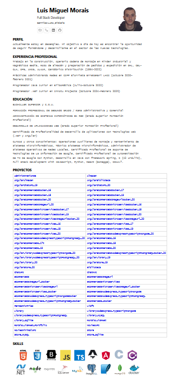

# moraisLuismNet_Portfolio

This website was developed with [Astro](https://astro.build/), a modern web framework for building fast and efficient static sites.


## Features  

- **Optimal Performance**: Thanks to Astro, the site is optimized to load only the necessary JavaScript.
- **Responsive Design**: Adapts perfectly to different screen sizes.
- **Dark/Light Mode**: Support for different color preferences.
- **Improved SEO**: Search engine optimized structure.

## Technologies Used

- [Astro](https://astro.build/) - The all-in-one web framework
- [TypeScript](https://www.typescriptlang.org/) - Static typing for JavaScript
- HTML5 and CSS3 - For structure and styles
- [Git](https://git-scm.com/) - Version control

## How to run the project locally

Follow these steps to run the project on your local machine:

1. **Clone the repository**
   ```bash
   git clone https://github.com/tu-usuario/moraisLuism_Portfolio.git
   cd moraisLuism_Portfolio
   ```

2. **Install dependencies**
   ```bash
   npm install
   # or
   yarn install
   ```

3. **Start the development server**
   ```bash
   npm run dev
   # or
   yarn dev
   ```

4. **Open your browser**
   The site will be available at [http://localhost:4321](http://localhost:4321)

## How to build for production

To generate an optimized version of the site:

```bash
npm run build
# o
yarn build
```

The static files will be generated in the `dist/` folder.

## Project Structure

```
/
├── public/         # Static files (images, fonts, etc.)
├── src/            # Source code
│   ├── components/ # Reusable components
│   ├── layouts/    # Design templates
│   ├── pages/      # Site pages
│   └── styles/     # Global styles
├── astro.config.mjs # Configuración de Astro
└── package.json    # Dependencias y scripts
```

[DeepWiki moraisLuismNet/moraisLuismNet_Portfolio](https://deepwiki.com/moraisLuismNet/moraisLuismNet_Portfolio)